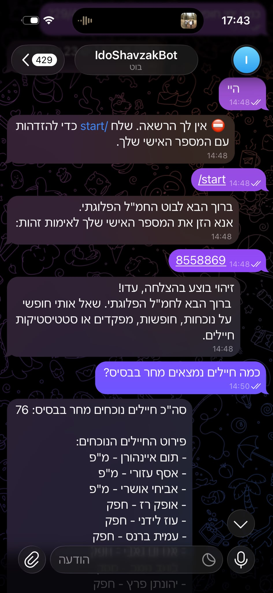
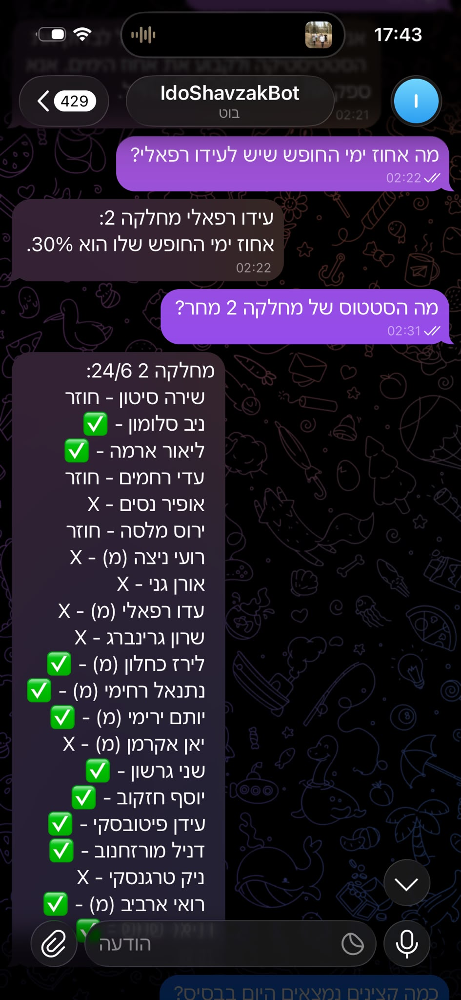

# Military Attendance Agent

A Telegram-based AI agent designed for military company headquarters, enabling commanders and soldiers to query personnel schedules, leave rosters, and base presence in natural Hebrew language — replacing manual spreadsheet lookups entirely.

---

## Screenshots

| Authentication | Department Status |
|---|---|
|  |  |

---

## Overview

In a dynamic military environment where schedules change constantly, platoon commanders need fast access to attendance data. This bot replaces the process of manually cross-referencing spreadsheets by providing an intelligent conversational agent accessible directly from Telegram.

A soldier types a question in free Hebrew — the bot understands it, queries the local database, and returns a structured military-style response in under 2 seconds.

---

## Features

- **Natural language queries** — Ask anything in free Hebrew: "Who is on base tomorrow?", "What is the status of platoon 2?", "How many vacation days does [soldier] have?"
- **7 query tools** — Presence by date, soldier schedule, status filtering, department reports, commander status, role-based stats, and aggregate summaries
- **Identity-based authentication** — Users authenticate with their personal military ID, verified against a whitelist pulled from Google Sheets
- **Persistent sessions** — Once authenticated, a user is recognized permanently across bot restarts
- **Smart text normalization** — Queries are immune to Hebrew quotation marks (גרשיים), making `מ"מ` and `ממ` equivalent
- **Manual sync command** — `/sync` lets authorized users refresh the database on demand

---

## Architecture

```
┌─────────────────────────────────────┐
│  Tier 1: Telegram (python-telegram-bot) │
│  Async messaging interface           │
└──────────────┬──────────────────────┘
               │
┌──────────────▼──────────────────────┐
│  Tier 2: OpenAI gpt-4o-mini          │
│  Function Calling Agent              │
│  Parses Hebrew → selects tool        │
│  Formats DB results → Hebrew reply   │
└──────────────┬──────────────────────┘
               │
┌──────────────▼──────────────────────┐
│  Tier 3: main.py + database.py       │
│  Routes tool calls, runs SQL queries │
└──────────────┬──────────────────────┘
               │
┌──────────────▼──────────────────────┐
│  Tier 4: SQLite + Google Sheets      │
│  Local cache synced from live sheet  │
└─────────────────────────────────────┘
```

**Request flow:**
1. User sends a message in Telegram
2. `gpt-4o-mini` reads the message and decides which of 7 tools to invoke
3. `main.py` routes the call to the correct `database.py` function
4. SQLite returns the result
5. A second OpenAI call formats the data into a structured Hebrew response
6. The answer is sent back to the user

---

## Tech Stack

| Component | Technology |
|---|---|
| Messaging | `python-telegram-bot` 20+ (async) |
| AI | `OpenAI gpt-4o-mini` with Function Calling |
| Database | `SQLite` via `sqlite3` |
| Google Sheets | `gspread` + `google-auth` |
| Config | `python-dotenv` |
| Language | Python 3.11 |

---

## Project Structure

```
Military-Attendance-Agent/
│
├── main.py              # Telegram handlers, OpenAI agent, request orchestration
├── database.py          # SQLite operations, SQL queries, text normalization
├── sync_service.py      # Google Sheets ETL pipeline
├── .env                 # API keys (not committed)
├── google_credentials.json  # Service account credentials (not committed)
└── pluga_shavzak.db     # Local SQLite cache (not committed)
```

---

## Key Engineering Decisions

**Local SQLite cache instead of live API calls**
Every user query hits local disk, not Google's servers. This eliminates rate limiting and keeps response times under 2 seconds regardless of Google API availability.

**Universal Hebrew text normalization**
Hebrew contains optional quotation marks (גרשיים) embedded in words like `מ"מ`, `חפ"ק`, `מ"פ`. A custom `normalize_text()` function strips these from both the search term and stored values before any comparison, making all lookups immune to typing variations.

**Schedule data stored as JSON strings**
Each soldier's full schedule is stored in a single column as a JSON string: `{"1/6": "1", "2/6": "י", "3/6": ""}`. This keeps the schema flexible — adding new dates to the sheet requires no database migration.

**Anti-hallucination pattern**
Instead of asking the AI to count list items (which leads to hallucinated numbers), every database function returns `{"total_count": N, "soldiers": [...]}`. The AI reads the count directly from the data.

**Two-call AI pattern**
- Call 1: Parse the question and select the right tool + parameters
- Call 2: Format the raw database result into a clean Hebrew response

This separation keeps each AI call focused on a single task, improving reliability.

---

## Status Codes

| Code | Meaning |
|---|---|
| `1` | Present on base |
| `י` | Departure day (counts as home) |
| `ח` | Return day (counts as present) |
| `א` | After (short evening leave) |
| `ג` | Sick leave (Gimelim) |
| ` ` | Home / vacation (empty cell) |
| `X` | Closed order — not in reserve duty |

---

## Setup

### Prerequisites
- Python 3.11+
- A Telegram bot token (via [@BotFather](https://t.me/BotFather))
- An OpenAI API key
- A Google Cloud service account with Sheets API access

### Installation

```bash
git clone https://github.com/idoraphaeli/Military-Attendance-Agent.git
cd Military-Attendance-Agent
pip install -r requirements.txt
```

### Configuration

Create a `.env` file:
```
TELEGRAM_TOKEN=your_telegram_token
OPENAI_API_KEY=your_openai_key
```

Place your `google_credentials.json` service account file in the project root.

### Run

```bash
python main.py
```

On startup, the bot syncs data from Google Sheets into the local SQLite database, then begins listening for messages.

---

## Authentication Flow

```
User sends any message
        ↓
Bot: "Please enter your personal military ID:"
        ↓
User enters ID
        ↓
Bot checks ID against authorized list (synced from Google Sheets)
        ↓
Authorized → session stored permanently
Not authorized → prompt to try again
```

---

## Example Queries

```
"כמה חיילים נמצאים מחר בבסיס?"
→ Returns total count + full list by role

"מה הסטטוס של מחלקה 2 מחר?"
→ Returns per-soldier status report for the platoon

"מי יוצא חופש היום?"
→ Returns all soldiers with departure status

"כמה ימי בית יש לעידו רפאלי?"
→ Returns aggregate vacation stats for the soldier

"איזה מפקדים נמצאים מחר?"
→ Returns command staff presence status
```

---

## Author

**Ido Raphaeli** — Computer Science Student
[GitHub](https://github.com/idoraphaeli)
